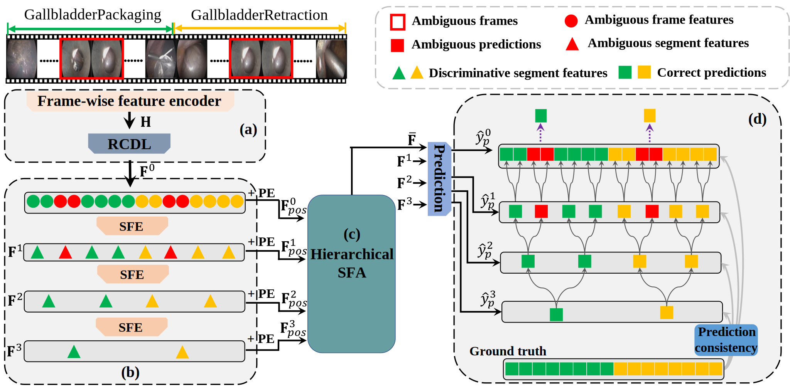

# Exploring Segment-level Semantics for Online Phase Recognition from Surgical Videos

## Introduction

This is a PyTorch implementation of [Exploring Segment-level Semantics for Online Phase Recognition from Surgical Videos].

In this papper, we design a temporal hierarchical network to generate hierarchical high-level segments to refine low-level frame predictions, based on [NETE](https://github.com/ChinaYi/NETE)

Framework visualization


## Preparation

**Datasets and our trained model**

Cholec80, M2CAI16 and our trained model [GoogleDrive](https://1drv.ms/f/s!Agn5nXKXMkK5aigB0g238YxuTxs)
 


## Run the code


**Installation**
  ```
    matplotlib==3.5.1
    numpy==1.20.3
    scikit_learn==1.0.2
    seaborn==0.11.2
    thop==0.0.31.post2005241907
    torch==1.9.0
    torchvision==0.10.0
    tqdm==4.61.2
  ``` 


**Train the model**
  ```shell
   python main.py --action=hierarch_train --hier=True --first=True --trans=True
  ```
(The model would be saved in "models/")

**Evaluate**

***Generate predictions***
  ```shell
    python main.py --action=hierarch_predict --hier=True --first=True --trans=True
  ```
(This would generate predictions in "results/")

***Evaluate the predcitions***
 ```shell
    matlab-eval/Main.m (cholec80)
    matlab-eval/Main_m2cai.m (m2cai16)
  ```

Mean jaccard: 83.53 +-  5.76
Mean accuracy: 91.85 +-  7.55
Mean precision: 91.75 +-  5.46
Mean recall: 91.74 +-  5.77

Mean jaccard: 84.92 +-  7.70
Mean accuracy: 91.99 +-  8.44
Mean precision: 93.74 +-  5.77
Mean recall: 92.88 +-  4.83


